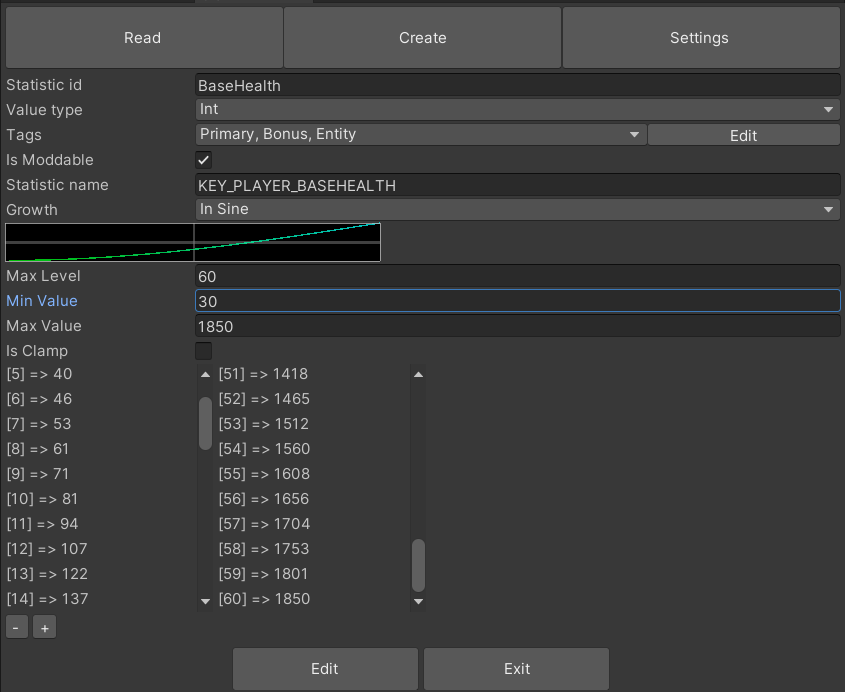
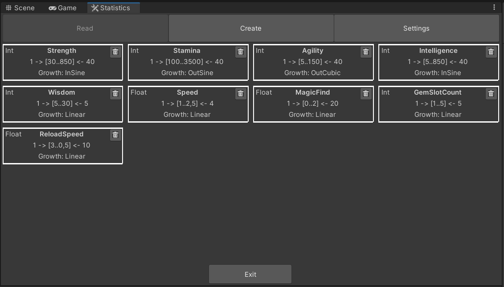
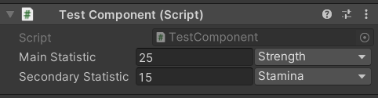
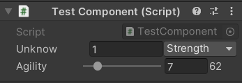

# StatsSmith

Smith-Statistic is a powerful tool designed to streamline game development by simplifying the management of statistics and values. Its key strengths include:

* **Configuration:** Quickly preview and configure values for each rank throught an easy a quick method, saving valuable time during development.
* **Consistency:** Ensures consistent values throughout the game, reducing errors and maintaining balance.
* **Developer Support:** Automatically generates a script containing all statistics as pure classes, providing a ready-to-use, lightweight system that integrates seamlessly into your project.
* **Designer-Friendly:** Empowers designers to configure and balance variables throughout development with ease, allowing for rapid iterations.
* **Developer Mode for Safety:** Includes a special developer mode to protect sensitive functionalities (e.g., script generation), minimizing the risk of accidental changes that could disrupt the codebase.

With Smith-Statistic, both developers and designers benefit from a robust, user-friendly solution for managing in-game statistics.

To disable developper mode, enabled by default, go to `Packages/Smith-Statistics/Editor/StatisticSettings.asset`. 

## How to install

Go to your unity's root project.\
Under the folder `Packages` open the file `Manifest.json`.\
Add the package and his dependencies to the project :
```json
{
  "dependencies": {
    ...
    "com.lrtools.utility":"https://github.com/Unity-LRTools/Utility.git",
    "com.lrtools.easing":"https://github.com/Unity-LRTools/Easing.git",
    "com.lrtools.smith.statistics":"https://github.com/Unity-LRTools/Smith-Statistics.git",
  }
}
```

## Practical example

When is it beneficial to use Smith-Statistic, and how can it be effectively implemented?

### Using Smith-Statistic in an RPG  

Imagine you're developing an RPG where the player has a health stat. Here's how **Smith-Statistic** can help:  

1. **Creating the Base Statistic**:  
   - Define a statistic named `baseHealth` for the player.  
   - Toggle it as moddable, since it will need to be modified during gameplay.  
   - This statistic will represent the player's maximum health at each level, without any additional modifiers.  
     - **Level 1**: 85 health points.  
     - **Level 60 (max level)**: 1535 health points.  

2. **Adding a Secondary Statistic**:  
   - Create another statistic called `Health`, representing health bonuses from items or equipment.  
   - Mark this statistic as non-modifiable and set its values based on item level. For example:  
     - **Level 1**: Items can provide a bonus of 10 health points.  
     - **Level 315**: Items can provide a bonus of 455 health points.  

3. **Combining Statistics**:  
   - Each piece of equipment the player wears will modify the `baseHealth` by adding the value of its `Health` statistic. This modification is applied using a simple offset system, ensuring the final health reflects both the player's base health and equipment bonuses.  

### Smith-Statistic in a Shooter Rogue-Like  

Let's say you're creating a shooter rogue-like. Here's how you can set up relevant statistics using **Smith-Statistic**:  

1. **Defining Ammo Capacity**:  
   - Create a moddable statistic called `AmmoCapacity`.  
   - This statistic will span from level 1 to level 5, representing an increase from **10 ammo** to **35 ammo**.  
   - It can be modified during gameplay through another statistic called `AmmoBonus`, which is affected by items the player collects.  

2. **Setting Reload Speed**:  
   - Define another statistic named `ReloadSpeed`.  
   - Use only 3 ranks for simplicity:
     - **Level 1**: 2.5 seconds.  
     - **Level 2**: 1.5 seconds.  
     - **Level 3**: 0.5 seconds.  
   - This statistic decreases reload time as the player pick this bonus, improving their efficiency with each rank.  

## Documentation

### Editor window
You can access the editor from the Unity main menu under Smith > Statistic.
The editor allows you to create new statistics, update existing ones, and configure the tool's settings.

### Statistic creation properties
The table below outlines the configurable properties for statistics in the system.



| **Property**|**Description**|
|--|------|
| **Statistic ID**| A unique identifier assigned to each statistic. This ID is also used as the class name for the generated property.|
| **Value Type** | Specifies the underlying data type for the statistic. Supported types include `int` and `float`.|
| **Is Moddable**| Indicates whether this statistic supports external modifications. Refer to the **ModStatistic** section for more details.|
| **Statistic Name**| The human-readable name or localization key associated with this statistic.|
| **Growth**| Determines the growth behavior of the statistic, leveraging common easing curves for dynamic scaling.|
| **Max Level**| Specifies the maximum allowable level for the statistic.|
| **Min Value**| Defines the value of the statistic at its minimum level (set to `1`).|
| **Max Value**| Defines the value of the statistic at its maximum level.|
| **Is Clamp**| Enables clamping to restrict the statistic’s value within defined bounds, if modifications are allowed.|
| **Clamp Min**| Specifies the minimum value limit for the statistic when clamping is enabled.|
| **Clamp Max**| Specifies the maximum value limit for the statistic when clamping is enabled.|



### Statistic Drawer
The statistics are displayed in the Inspector, where you can select the level and type of each statistic.\


The type can be inferred from the property name if it matches the class name. For example, if you have a statistic named `Agility` and a property like `public Statistic agility = new Statistic()`, the drawer will automatically recognize that you want to display the Agility statistic and fetch its corresponding range data.\


## API Documentation
### Statistic Class

Represents a statistic that dynamically changes based on its level.

### Events
| **Name**| **Description**|
|--|------|
| `OnValueChanged` | Triggered whenever the statistic's value changes. Provides the updated statistic. |

### Properties
| **Name** | **Type** | **Description**|
|--|--|-----|
| `ID` | `string` | A unique identifier representing the type of statistic. Serialized.|
| `Level` | `int` | The current level of the statistic. Changing this property recalculates its value. Serialized.|
| `Name` | `string` | The display name or localization key of the statistic.|
| `Value` | `float` | Gets the current calculated value of the statistic based on its level.|

### Methods
| **Signature** | **Description** |
|--|------|
| `float? GetValueAt(int level)` | Returns the statistic's value at a specific level. Throws an exception if the level is out of range.|
| `StatisticSave Save()` | Returns all the field needed to save a statistic in a struct.|

## Mod Statistic

Extends `Statistic` to support modifications such as offsets, percentages, and clamping. Allows for precise control over value adjustments through modifiers.

### Properties
| **Name** | **Type** | **Description** |
|--|---|-----|
| `Offsets` | `IReadOnlyList<Modifier>`| A list of offset modifiers applied to the statistic.|
| `Percentages` | `IReadOnlyList<Modifier>`| A list of percentage modifiers applied to the statistic.|
| `clampMin` | `float` | The minimum value the statistic can reach after modifications.|
| `clampMax` | `float` | The maximum value the statistic can reach after modifications.|
| `fixedValue` | `float?` | A fixed value overriding all other calculations.|
| `fixedPercentage` | `float?` | A fixed percentage multiplier overriding all other calculations, except fixed value.|

### Methods
| **Signature** | **Description**|
|--|-----|
|`void AddOffset(float value, string identifier)` | Adds an offset modifier. Can be positive or negative.|
|`void RemoveOffset(string identifier)`| Removes an offset modifier by its identifier.|
|`void AddPercentage(float value, string identifier)` | Adds a percentage modifier. Throws an exception if the value is 0.|
|`void RemovePercentage(string identifier)` | Removes a percentage modifier by its identifier.|
|`void SetFixedValue(float value)` | Sets a fixed value for the statistic, overriding other calculations.|
|`void RemoveFixedValue()` | Removes the fixed value, reverting to normal calculations.|
|`void SetFixedPercentage(float value)` | Sets a fixed percentage multiplier, overriding other calculations.|
|`void RemoveFixedPercentage()` | Removes the fixed percentage multiplier.|
|`ModStatisticSave Save()` | Returns all the field needed to save a modstatistic in a struct.|

## ListStatistic
Extends `List<T> where T : Statistic` to grant behaviour directly linked to statistic.

### Methods
| **Signature** | **Description**|
|--|-----|
|`float Sum(string type)` | Return the sum of the desired type.|
|`float CountStatistic()`| Count the total number of different statistic in the list.|

## Examples
### Simple usage
An example where we set the level of the statistic then get his value.
```csharp
public void Example() 
{
    Power power = new Power();
    power.Level = 4;
    Debug.Log(power);
}
```
Here we are gonna set all the player statistic to 20% of their actual value.
```csharp
public void Example() 
{
    Player player = new Player();
    foreach(ModStatistic statistic in player.statistics) 
    {
        statistic.RemoveFixedValue(); // Ensure there is no fixed value because they have greater priority over fixed percentage
        statistic.SetFixedPercentage(0.2f); // The statistic base value will be multiply by 0.2 and skip other modifications
    }
}
```
It's also possible using StatisticList<T> to sum value inside the list or have helping method.
```csharp
public void Example() 
{
    StatisticList<ModStatistic> list = new StatisticList<ModStatistic>();
    list.Add(new Power()); // By default it can be 5
    list.Add(new Power());
    list.Add(new Health());
    
    Debug.Log(list.Sum(nameof(Power))); // "10"
    Debug.Log(list.Count); // "3"
    Debug.Log(list.CountStatistic()); // "2", because there only 2 different statistic
}
```

### Save & Load
Here is how to save a `Statistic` and load it again. It goes the same for `ModStatistic`.
```csharp
public void SaveAndLoad() 
{
    Health health = new Health();
    StatisticSave saveData = health.Save(); // return a serializable struct with only serializable field
    // Save this struct somewhere and get it later
    Statistic statistic = StatisticSaveHelper.Load(saveData);
    health = statistic as Health;
}
```